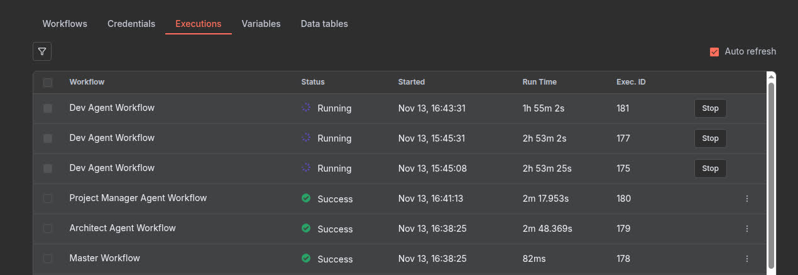
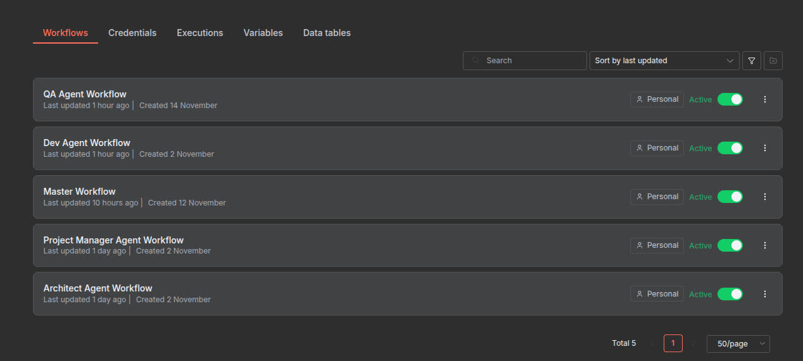
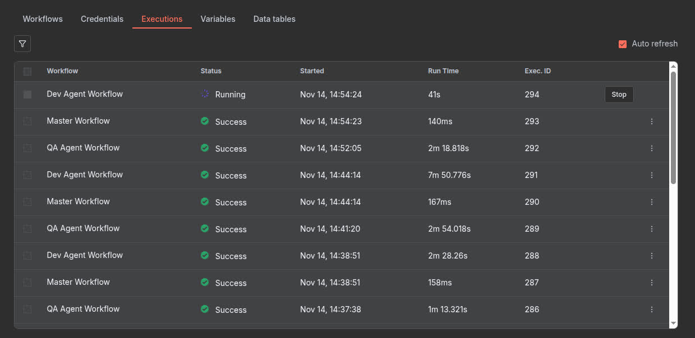
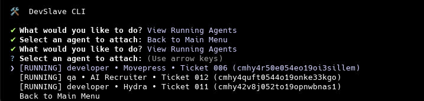
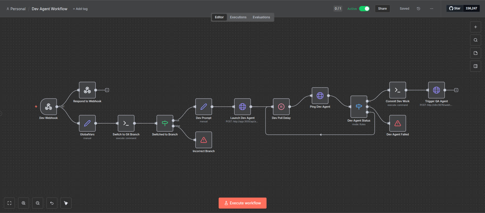

# DevSlave

> An AI-powered agentic workflow system for autonomous software development

DevSlave is a sophisticated orchestration platform that enables AI agents (powered by OpenAI Codex) to autonomously build, test, and maintain software projects within isolated Docker environments. The system uses n8n workflows to coordinate multiple specialized agents (Architect, PM, Developer, QA) through a complete SDLC process.

DevSlave spins up multiple Codex agents with **dangerously-bypass-approvals-and-sandbox** ON, inside an isolated Docker container. Each agent gets its own tmux session that we can manage using n8n and a custom-built Typescript API to handle project setup, logging, and tmux session spawning. 

Once you start a workflow, it is hands-free.


(sorry for the jaundiced filter)

## 🎯 Concept

DevSlave creates a **sandboxed development environment** where AI agents can freely execute commands, write code, run tests, and interact with version control—all while being guided through structured workflows. Think of it as giving your AI coding assistant its own computer to work on.

### Key Innovation

Unlike traditional AI coding assistants that require human intervention at every step, DevSlave agents:

- **Run autonomously** in isolated tmux sessions within Docker containers
- **Follow structured workflows** orchestrated by n8n
- **Track their own progress** through database-backed state management
- **Handle full development cycles** from design through QA

## ✨ Features

- 🐳 **Docker-based isolation** - Agents operate in controlled, reproducible environments
- 🤖 **Multi-agent orchestration** - Specialized agents for architecture, PM, development, and QA
- 🔄 **n8n workflow automation** - Visual workflow design with webhook-driven execution
- 📊 **Database-backed state** - Prisma + PostgreSQL for tracking projects, agents, and tickets
- 🎛️ **Interactive CLI** - Full-featured terminal interface for managing workflows
- 🔍 **Real-time monitoring** - Watch agent progress through tmux session logs
- 🎫 **Ticket-driven development** - Structured work items with status tracking
- 🔐 **Security-first** - Gitleaks integration and pre-commit hooks

### Component Overview

| Component          | Purpose                                                            |
| ------------------ | ------------------------------------------------------------------ |
| **Express API**    | REST endpoints for agent lifecycle, status, and project management |
| **n8n Workflows**  | Visual orchestration of agent handoffs and process flows           |
| **tmux Sessions**  | Isolated agent execution environments with log capture             |
| **PostgreSQL**     | State persistence (agents, codebases, tickets, events)             |
| **Ollama**         | Local LLM inference (optional, falls back to OpenAI)               |
| **Docker Volumes** | Persistent storage for agent workspaces and dependencies           |

See [docs/architecture.md](docs/architecture.md) for detailed architecture documentation.

## 📋 Prerequisites

- **Docker** & **Docker Compose** (v2+)
- **Node.js** 22+ (for local development)
- **OpenAI API Key** or **Ollama** (for Codex agents)
- **PostgreSQL** 16+ (via Docker)
- **Git** with configured credentials

### Optional

- **Codex CLI** configured with credentials
- **SSH keys** for repository access

## 🚀 Quick Start

### 1. Clone and Setup

```bash
git clone https://github.com/AlextheYounga/devslave
cd devslave
cp .env.example .env
```

### 2. Configure Environment

Edit `.env` and set:

```bash
# Git Configuration
GIT_USERNAME="Your Name"
GIT_EMAIL=your@email.com

# Optional: OpenAI Codex
CODEX_OSS_BASE_URL=https://api.openai.com
PROJECT_OUTPUT_DIR=/path/to/your/projects
```

### 3. Start Services

```bash
docker-compose up -d
```

This starts:

- PostgreSQL (port 5432)
- Redis (for n8n queue)
- n8n (port 5678)
- n8n-worker
- Ollama (port 11434)
- App container (port 3000)

### 4. Import n8n Workflows

1. Open n8n: http://localhost:5678
2. Import workflows from `docker/n8n/workflows/`:
    - Master Workflow.json
    - Architect Agent Workflow.json
    - Project Manager Agent Workflow.json
    - Dev Agent Workflow.json
    - QA Agent Workflow.json
3. Activate all workflows



### 5. Run Database Migrations

**This may not be necessary as the Docker container also runs this on start, but good to run just in case.**

```bash
npx prisma migrate dev
```

### 6. Use the CLI

```bash
# Install CLI (should only run from this project)
npm link

# Or run directly
npm run dev
```

## 🎮 Usage

### CLI Commands

The `devs` CLI is your main interface:

```bash
devs # Interactive menu
```

Start building



#### Interactive Menu Options



1. **Create Project** - Initialize a new codebase with agent-ready structure
2. **View Running Agents** - Attach to active agent sessions or view their logs
    - Attach to tmux session (watch agent work in real-time)
    - View log events (JSONL formatted agent output)
    - Kill stuck agents
3. **Start Workflow** - Trigger the master workflow for a project
4. **Utilities** - Access tools and helpers
    - Open shell in app container
    - Open agent container in VS Code (remote development)
    - Start Docker services
    - Open n8n UI
    - Clone project to local machine

### Typical Workflow

```bash
# 1. Create a new project
devs
# Select: Create Project
# Follow prompts to set up project structure

# 2. Start the agent workflow
devs
# Select: Start Workflow
# Choose your project

# 3. Monitor progress
devs
# Select: View Running Agents
# Choose agent, then:
#   - Select "Attach to tmux" to watch in real-time
#   - Select "View logs" to see structured events
#   - Select "Kill agent" if stuck

# 4. Clone completed work
devs
# Select: Utilities → Clone Project
# Project downloaded to PROJECT_OUTPUT_DIR
```

### Accessing the Container

The CLI provides multiple ways to interact with the Docker container:

**1. Shell Access (via CLI)**

```bash
devs
# Select: Utilities → Open Shell in App Container
# Drops you into bash inside the container
```

**2. VS Code Remote Development (via CLI)**

```bash
devs
# Select: Utilities → Open Agent Container on VSCode
# Opens the container in VS Code with full IDE features
```

**3. Direct Docker Command**

```bash
# Manual shell access
docker-compose exec app bash

# Or use the helper script
./docker/dev-container.sh
```

**4. VS Code Remote Setup**

```bash
# Use the helper script
./docker/vscode-remote.sh

# Or manually attach:
# 1. Install "Dev Containers" extension in VS Code
# 2. Open Command Palette (Cmd+Shift+P)
# 3. Select "Dev Containers: Attach to Running Container"
# 4. Choose "devslave-app-1"
```

## 🔄 Agent Workflow

The system follows a phase-based development approach:

### 1. **DESIGN** Phase

**Architect Agent** creates:

- Technical specification
- Architecture diagrams
- Technology stack decisions
- File structure outlines

### 2. **PLANNING** Phase

**PM Agent** generates:

- User stories
- Development tickets
- Acceptance criteria
- Priority ordering

### 3. **DEVELOPMENT** Phase

For each ticket:

1. **Dev Agent** implements the feature
2. **QA Agent** reviews and tests
3. Cycle repeats until ticket passes QA

### 4. **COMPLETED** Phase

Project marked complete when all tickets are closed.



See [docs/workflows.md](docs/workflows.md) for detailed workflow documentation.

## 🗂️ Project Structure

```
devslave/
├── src/
│   ├── server.ts              # Express API server
│   ├── routes.ts              # API route definitions
│   ├── cli/                   # CLI implementation
│   ├── controllers/           # Request handlers
│   ├── handlers/              # Business logic
│   ├── prompts/               # Agent system prompts
│   └── scripts/               # Bash automation scripts
├── docker/
│   ├── app/                   # App container setup
│   ├── n8n/workflows/         # n8n workflow definitions
│   └── pg/                    # PostgreSQL initialization
├── prisma/
│   ├── schema.prisma          # Database schema
│   └── migrations/            # Database migrations
├── test/                      # Jest test suite
└── docs/                      # Additional documentation
```

## 🧪 Testing

```bash
# Run all tests
npm test

# Run tests with coverage
npm test -- --coverage

# Run specific test file
npm test -- agent.controller.test.ts
```

Tests use a dedicated PostgreSQL database (`devslave_test`) automatically managed by the test setup.

## 🐛 Troubleshooting

### Agent Not Starting

```bash
# Check container logs
docker-compose logs app

# Verify database connection
docker-compose exec app npx prisma db pull

# Check tmux sessions
docker-compose exec app tmux ls
```

### n8n Workflows Not Triggering

1. Verify webhook URL in `.env`:
    ```bash
    N8N_MASTER_WEBHOOK_URL=http://localhost:5678/webhook/master
    ```
2. Check workflow is activated in n8n UI
3. Review n8n execution logs

### Database Issues

```bash
# Reset database (⚠️ destroys data)
npm run db:reset:test

# Re-run migrations
docker-compose exec app npm run db:migrate
```

### Container Build Failures

```bash
# Clean rebuild
docker-compose down -v
docker-compose build --no-cache
docker-compose up -d
```

## 🔒 Security Considerations

- **Container Isolation**: Agents run in Docker with limited host access
- **Git Credentials**: Use SSH keys, never hardcode passwords
- **Secret Scanning**: Gitleaks runs automatically on commits
- **Environment Variables**: Never commit `.env` files
- **API Keys**: Rotate n8n API keys regularly

## 📚 Documentation

- [Quick Reference](docs/quick-reference.md) - Common commands and operations
- [System Diagrams](docs/diagrams.md) - Visual architecture and flow diagrams
- [Architecture Deep Dive](docs/architecture.md) - System design and components
- [Workflow System](docs/workflows.md) - n8n orchestration and agent coordination
- [Agent Lifecycle](docs/agent-lifecycle.md) - How agents are spawned and managed
- [Development Guide](docs/development.md) - Contributing and local development
- [Docker Setup](docs/docker-setup.md) - Container architecture and configuration

## 🛠️ Development

### Code Style

```bash
# Format all files
npm run format
```

We follow Clean Code principles and prioritize:

- **Clarity over cleverness**
- **Simplicity over abstraction**
- **Consistency over innovation**

See [AGENTS.md](AGENTS.md) for complete engineering philosophy.

## 🤝 Contributing

1. Fork the repository
2. Create a feature branch
3. Write tests first (TDD)
4. Implement changes
5. Run tests: `npm test`
6. Format code: `npm run format`
7. Submit pull request

## 📜 License

ISC

## 👥 Authors

Alex Younger, Trey Goff

## 🙏 Acknowledgments

- OpenAI Codex for agent runtime
- n8n for workflow orchestration
- Prisma for type-safe database access

---

**Note**: This is an experimental system. Always review agent-generated code before deploying to production.
